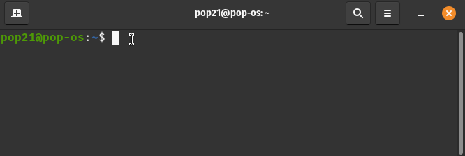

# onoff

If you own a [Netgear XR500](https://www.netgear.com/home/online-gaming/routers/xr500/) router and want the ability to toggle your guest network on/off then this utility might be for you. It can be used in interactive or backgroud mode (to automate on a schedule).



## System requirements

- working installation of [npm]() to set up as a command line utility.
- ability to clone this repository.

## Installation

```
npm install -g .
```

## Usage

`onoff --help`

**Result**

```groovy
onoff <command>

Commands:
  onoff background [options]  Examples:
                                onoff background --password <password>
                                ... is the same as ...
                                onoff b -p <password>             [aliases: b]
  onoff interactive           Examples:
                                onoff interactive
                                ... is the same as ...
                                onoff i                           [aliases: i]

Options:
  --version  Show version number                                       [boolean]
  --help     Show help                                                 [boolean]
```

### Interactive

`onoff interactive --help`

**Result**

```groovy
onoff interactive

Examples:
onoff interactive
... is the same as ...
onoff i

Options:
  --version  Show version number                                       [boolean]
  --help     Show help                                                 [boolean]
```

### Backgroud

`onoff background --help`

**Result**

```groovy
onoff background [options]

Examples:
onoff background --password <password>
... is the same as ...
onoff b -p <password>

Options:
  --version        Show version number                                 [boolean]
  --help           Show help                                           [boolean]
  --password, --p  password for admin login to XR500 router  [string] [required]
```